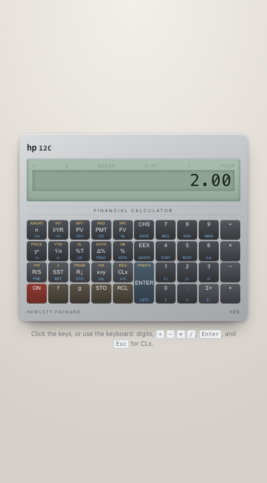
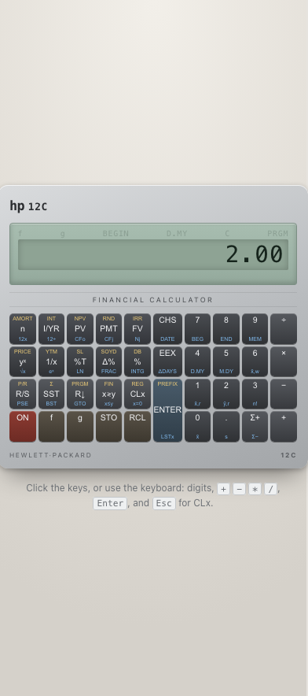

# HP-12C

A faithful HP-12C financial calculator, rebuilt from the Owner's Handbook as a
Svelte 5 + TypeScript app.



<p align="center">
  
</p>

## Running it

```sh
npm install
npm run dev      # dev server with HMR
npm run build    # production build into dist/
npm run preview  # serve the built output
npm run check    # svelte-check + tsc, fails on any diagnostic
npx vitest run   # 101 unit tests
```

There is no backend and no network access at runtime; everything is local.

## What it does

| Area | Keys |
| --- | --- |
| RPN stack | four-register stack, LAST X, `x≷y`, `R↓`, `CLx` |
| Arithmetic | `+ − × ÷`, `1/x`, `yˣ`, `√x`, `eˣ`, `LN`, `%T`, `Δ%`, `%` |
| TVM | `n`, `I/YR`, `PV`, `PMT`, `FV`, `12×`, `12÷`, amortisation |
| Cash flow | `CF₀`, `CFⱼ`, `Nⱼ`, `NPV`, `IRR` |
| Statistics | `Σ+`, `Σ−`, `x̄`, `s`, `x̂,r`, `ŷ,r`, `x̄,w` |
| Dates | `D.MY`, `M.DY`, `ΔDAYS`, `DATE` |
| Bonds | `PRICE`, `YTM` |
| Depreciation | `SL`, `SOYD`, `DB` |
| Program mode | 99 steps, `P/R`, `PSE`, `GTO`, `R/S`, `SST` |

## How it is put together

```
src/
  App.svelte              keyboard and button input
  lib/hp12c/
    engine.ts             the whole calculator: one mutable state machine
    keys.ts               physical layout, labels, keycodes
    tvm.ts                TVM equations and amortisation
    finance.ts            NPV, IRR, bonds, depreciation
    dates.ts              date parsing and arithmetic
    stats.ts              statistics accumulators and estimators
    format.ts             rounding and the ten character LCD field
    Display.svelte        LCD and the six annunciators
    Keypad.svelte         responsive 39 key keypad
```

`engine.ts` is deliberately independent of Svelte. The UI calls `press(id)` and
reads back a `View`; nothing in the engine imports a UI library. That is what
lets the whole calculator be tested through key presses alone, the way it is
actually used.

Behaviour that is easy to get wrong follows Appendix A of the handbook, "The
Automatic Memory Stack": digit entry lifts the stack unless ENTER or a
financial register store came before it, two-number functions drop the stack
while percentage functions do not, and LAST X takes the old X for every
function except the stack shuffles.

## Fidelity notes

The handbook is the reference, including where it contradicts itself:

- **`12C` divides Y by X.** `8 ENTER 10 ÷` is `0.80`, not `1.25`.
- **Digit entry holds ten significant digits.** Dates are keyed as ten digit
  decimal mantissas so a trailing zero you typed survives.
- **`Σ+` takes X as the x-value and Y as the y-value**, and leaves the running
  count of observations in X.
- **`RCL i` reads back as a percent** while the register holds a decimal rate.
- **The handbook's own regression table is inconsistent** with the regression it
  prints. The mathematically correct least squares line is implemented instead:
  at `x = 48` it gives `27,475.75`.
- **The duplex IRR is an erratum in the printed book.** Its cash flows put the
  root at `13.06%`; the printed `13.72%` leaves NPV at `-2,176.23`. The NPV of
  `212.18` at `13%` reproduces exactly, which confirms the flows are right.

Two labels, `x=r` and `x̄,w`, have working handlers but no gold label on the
keypad: the digit row is already spoken for by `f` + digit FIX formatting.

## Tests

101 unit tests, all driven through the engine's public key interface and checked
against worked examples in the handbook.

```
 src/lib/hp12c/engine.test.ts   54
 src/lib/hp12c/modules.test.ts  29
 src/lib/hp12c/tvm.test.ts      18
```

## Sources

- [HP-12C Owner's Handbook](https://literature.hpcalc.org/community/hp12c-oh-en.pdf)
- [HP-12C User's Guide](https://literature.hpcalc.org/official/hp12c-ug-en.pdf)
- [Classic reference](https://www.finseth.com/hpdata/hp12c.php)

This is an independent reimplementation for study and is not affiliated with or
endorsed by HP.